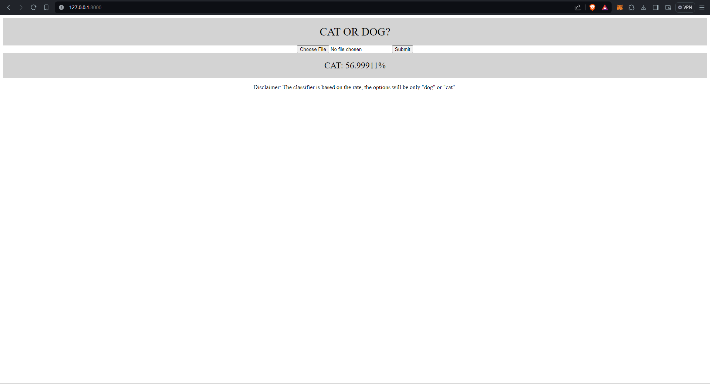

# Cat & Dog Classifier

This project is a web application designed to classify images as either "CAT" or "DOG" with a prediction confidence rate. The application provides a simple and intuitive interface for users to upload an image. If no image is uploaded, the website displays the message "No image is uploaded." Upon image upload, the application utilizes a trained machine learning model to predict whether the uploaded image contains a cat or a dog, along with the corresponding confidence rate of the prediction.

This project serves as a demonstration of image classification using machine learning techniques and showcases how such models can be integrated into web applications for real-world use cases. It can be further extended with additional features such as multi-class classification, image preprocessing, and model retraining to improve accuracy and usability.

## Setup

1. Spin up a docker container - tensorflow/serving
2. Bind the [model](model) to expose a port 8510 to POST request to predict by `docker run -p 8501:8501 --mount type=bind,source=model,target=/models/my_model/1/ -e MODEL_NAME=my_model -t tensorflow/serving`
3. Create and activate a virtualenv and install the requirements `pip install -r requirements.txt`
4. Run `python manage.py migrate` and `python manage.py runserver`
5. Open `http://localhost:8000/` in your browser

# Screenshot

